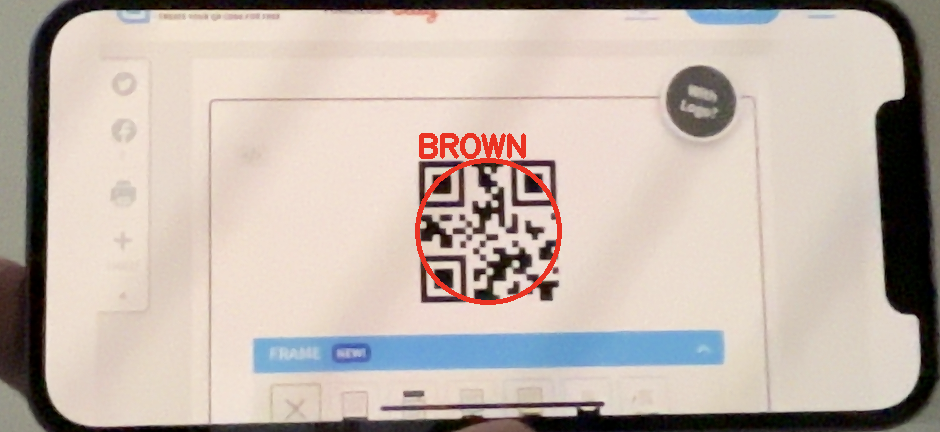

# qr-detector

Requirements:
- Python 3.10
- [zbar library](https://pypi.org/project/pyzbar/)
    - Linux: `sudo apt-get install libzbar0`
    - Mac: `brew install zbar`
    - Windows: installed automatically

Install:
```
pip install git+https://github.com/AGH-Drone-Engineering/qr-detector
```

See [main.py](main.py) for example usage.


